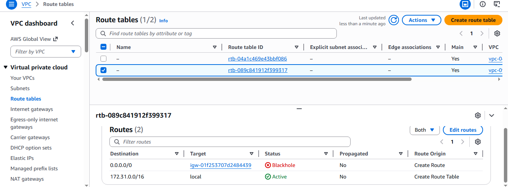
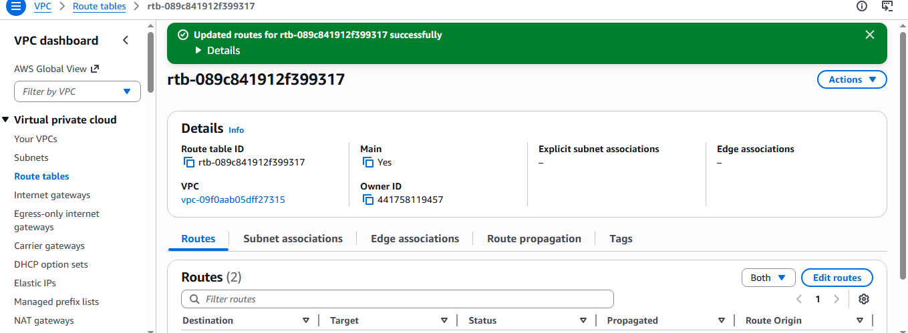

# AWS Cloud Cost Optimization & Automated Deployment

## 🎯 Project Goal
To demonstrate a "Real-World" cloud migration: resolving networking connectivity issues, automating server setup, and reducing infrastructure costs by **88%** through resource right-sizing.

---

## 🌐 Phase 1: Networking & Connectivity
A VPC is a "walled garden" by default. I manually architected the networking layer to allow public internet traffic to reach the web server.

### 🛠️ The Infrastructure
* **IGW Configuration:** Created and attached the Internet Gateway (`igw.png`, `attached.png`).
* **Route Table Resolution:** Identified a **"Blackhole"** status in the routing (`blackhole.png`) and resolved it by routing `0.0.0.0/0` to the IGW (`rtb.png`).

  
  
   
  <em>From "Blackhole" to "Active" routing.</em>

---

## 🚀 Phase 2: Automated Deployment (The Baseline)
To establish a performance baseline, I launched a high-capacity **t3.large** instance.

### 🤖 Automation via User Data
Instead of manual installation, I used the [`install-apache.sh`](./install-apache.sh) script to automate the Apache web server setup on first boot.

* **Instance Selection:** Configured a **t3.large** with a custom Key Pair (`t3 and key.png`, `name.png`).
* **Security:** Opened Port 80 (HTTP) and Port 22 (SSH) via a custom Security Group (`sg.png`).
* **Verification:** The website successfully loaded the "Baseline" page automatically (`liveweb.png`).

---

## 💰 Phase 3: Cost Optimization (Right-Sizing)
Technical analysis showed that the **t3.large** (8GB RAM) was overkill for a simple landing page.

### 📉 The Efficiency Move
1. **The Problem:** Used `free -h` in the terminal to verify that 90% of memory was idle (`terminal.png`).
2. **The Fix:** **Stopped** the instance (`stop.png`) and **Changed the Instance Type** (`change.png`) to a **t3.micro**.
3. **The Result:** Verified the website still functioned perfectly on the cheaper hardware (`after.png`).

| Metric | Baseline (t3.large) | Optimized (t3.micro) |
| :--- | :--- | :--- |
| **Memory** | 8 GB | 1 GB |
| **Monthly Cost** | ~$60.00 | ~$7.00 |
| **Savings** | - | **88% Reduction** |

---

## 🧼 Phase 4: Responsible Decommissioning
To ensure no ongoing "hidden" costs, I performed a full cleanup of the environment.

* **Termination:** Terminated the instance to stop all compute charges (`terminate.png`).
* **Final Verification:** Verified the EC2 dashboard shows **0 Running Instances**, confirming a clean environment (`0running.png`).
* **Network Cleanup:** Detached and deleted the custom Internet Gateway and Security Groups to ensure the VPC was returned to its baseline state.
---

## 💡 Key Takeaways
* **Cloud Economics:** Monitoring tools like `free -h` are essential for protecting the company budget.
* **Automation:** Bootstrapping ensures infrastructure is repeatable and human-error-free.
* **Networking:** Deep understanding of VPC Routing is the foundation of a Cloud Architect's role.
